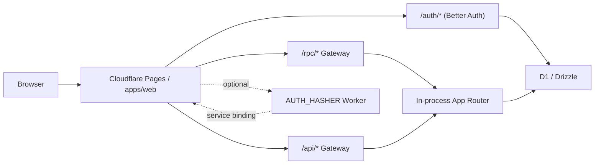
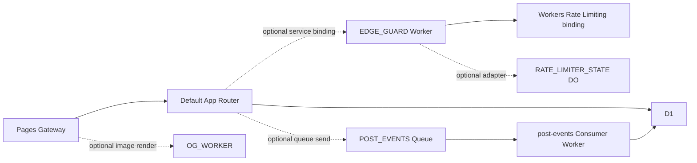

# Cloudflare First Starter

Cloudflare-first GitHub template for teams that want a contract-first stack without pretending deployment choices do not matter.

Korean translation: [`README_ko.md`](./README_ko.md)

## What This Template Gives You

- `SvelteKit` running on Cloudflare Pages
- `oRPC` + `typia` as the shared contract and schema layer
- `Drizzle` + `D1` as the default relational data path
- `better-auth` mounted under `/auth/*`
- an in-process gateway for `/rpc/*` and `/api/*` by default
- an optional `/og.png` route backed by a dedicated OG Worker
- a minimal auth-scoped CRUD example under `/posts`
- an internal `AUTH_HASHER` Worker with a TypeScript shell and Rust Wasm kernel
- automatic password rehash on successful email/password sign-in when the stored hash is older than the active `AUTH_HASHER` preset
- optional advanced examples for `EDGE_GUARD` rate limiting, `POST_EVENTS` async projection, and `OG_WORKER` image rendering

This template is intentionally opinionated. It is not trying to be infra-agnostic.

## Architecture



Default public surface:

- `/auth/*`
- `/rpc/*`
- `/api/*`
- `/api/docs`
- `/api/docs/rpc`
- `/og.png` when the optional OG worker is attached

The recommended extension path stays explicit:

1. `packages/shared`
2. `packages/api`
3. `packages/gateway`
4. `apps/*`

## Quick Start

Install and validate the template:

```bash
bun install --frozen-lockfile
bun run check
```

Choose one local runtime:

- `bun run dev:web:solo`
  fastest loop, local SQLite, in-process `/rpc`
- `bun run dev`
  Vite web app plus Bun API server
- `bun run dev:web:cf`
  local Pages + D1 parity

## Deploy To Cloudflare

1. Create a D1 database and copy the returned `database_name` and `database_id` into [apps/web/wrangler.toml](./apps/web/wrangler.toml).

```bash
bunx wrangler d1 create <your-d1-name>
```

2. Set `BETTER_AUTH_URL` in [apps/web/wrangler.toml](./apps/web/wrangler.toml) to your deployed Pages origin.
3. Store `BETTER_AUTH_SECRET` as a Pages secret instead of a checked-in config var.

```bash
bunx wrangler pages secret put BETTER_AUTH_SECRET --project-name <your-pages-project>
```

4. Deploy the auth hasher Worker.

```bash
bun run --cwd apps/auth-hasher-worker deploy
```

5. In your Cloudflare Pages project, configure:
   - optional: `GITHUB_CLIENT_ID`
   - optional: `GITHUB_CLIENT_SECRET`
6. Keep the `AUTH_HASHER` service binding in [apps/web/wrangler.toml](./apps/web/wrangler.toml) pointed at `cloudflare-first-starter-auth-hasher`.
7. Deploy the Pages app with your normal Pages workflow.

For local-only secrets and D1 HTTP migration config, copy from [apps/web/.dev.vars.example](./apps/web/.dev.vars.example).
After changing Wrangler bindings in `apps/web`, `apps/worker-edge-guard`, or `apps/worker-post-events`, regenerate the checked-in binding types with `bun run types:cf`.
If you also change the optional OG worker bindings, rerun `bun run types:cf` as well.

## Advanced Examples

The default template does not need extra application Workers.



Use extra Workers only when Cloudflare capabilities are the reason:

- rate limiting
- coordinated edge state
- async side effects
- dedicated image rendering and cache isolation
- Durable Object backed workflows

Current notes:

- `bun run dev:web:cf:services` is an advanced reference mode only.
- It boots the capability example path: `EDGE_GUARD` + `POST_EVENTS` + `OG_WORKER`.
- On `localhost`, auth hashing falls back only if Wrangler cannot proxy the local `AUTH_HASHER` session.
- On `localhost`, `post_activity` is also projected inline so the advanced example stays visible even when local Queue emulation lags.
- On `localhost`, `/og.png` prefers `OG_WORKER_BASE_URL` and falls back to the `OG_WORKER` service binding.
- `apps/worker-content` and `apps/worker-meta` are transitionary reference implementations for service-binding experiments.
- They are not the recommended default topology for this template.
- They remain in the repo only as legacy references.

Advanced example bindings:

- `EDGE_GUARD`
  service binding for cross-cutting post creation policy
- `POST_EVENTS`
  Queue producer used to project `post.created` into `post_activity`
- `OG_WORKER`
  optional HTTP worker used to render `/og.png` as PNG
- `RATE_LIMITER_STATE`
  Durable Object namespace used only when `EDGE_GUARD_MODE=do`

Advanced example files:

- [`apps/web/wrangler.services.toml`](./apps/web/wrangler.services.toml)
- [`apps/worker-edge-guard`](./apps/worker-edge-guard)
- [`apps/worker-post-events`](./apps/worker-post-events)
- [`apps/worker-og`](./apps/worker-og)

## Validation Bar

Fresh clone release bar:

```bash
bun install --frozen-lockfile
bun run check
bun run test:unit
bun run test:e2e
bun run --cwd apps/web test:e2e:solo
bun run smoke:web:cf:services
cargo check --manifest-path apps/auth-hasher-worker/Cargo.toml --target wasm32-unknown-unknown
```

Template hygiene rules:

- do not commit Playwright `test-results/`
- do not commit `.wrangler/state`
- do not commit temp SQLite files
- keep checked-in OpenAPI output in sync with `bun run gen:openapi`
- keep checked-in Cloudflare binding types in sync with `bun run types:cf`

## Package Docs

- [`apps/web/README.md`](./apps/web/README.md)
- [`apps/auth-hasher-worker/README.md`](./apps/auth-hasher-worker/README.md)
- [`packages/auth-hasher-contracts/README.md`](./packages/auth-hasher-contracts/README.md)
- [`packages/auth-hasher-client/README.md`](./packages/auth-hasher-client/README.md)
- [`packages/auth-hasher-better-auth-adapter/README.md`](./packages/auth-hasher-better-auth-adapter/README.md)
- [`packages/auth-hasher/README.md`](./packages/auth-hasher/README.md)
- [`apps/worker-edge-guard/README.md`](./apps/worker-edge-guard/README.md)
- [`apps/worker-post-events/README.md`](./apps/worker-post-events/README.md)
- [`apps/worker-og/README.md`](./apps/worker-og/README.md)
- [`packages/shared/README.md`](./packages/shared/README.md)
- [`packages/db/README.md`](./packages/db/README.md)
