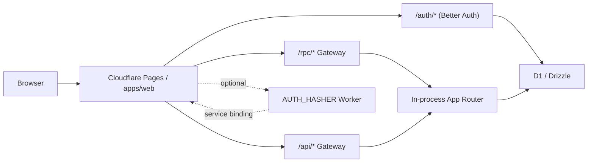
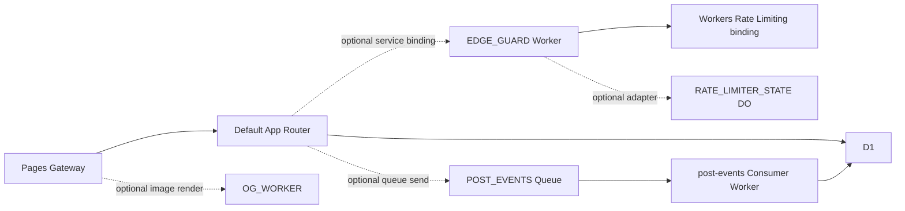

# Cloudflare First Starter

Cloudflare 배포 현실을 숨기지 않으면서 contract-first 스택을 바로 시작할 수 있게 만든 GitHub 템플릿입니다.

영문 기본 문서: [`README.md`](./README.md)

## 이 템플릿이 주는 것

- Cloudflare Pages 위에서 실행되는 `SvelteKit`
- 공용 계약과 스키마 계층인 `oRPC` + `typia`
- 기본 관계형 데이터 경로인 `Drizzle` + `D1`
- `/auth/*` 아래에 마운트된 `better-auth`
- 기본값으로 동작하는 in-process `/rpc/*`, `/api/*` gateway
- 전용 OG worker를 붙이면 사용할 수 있는 선택적 `/og.png` 라우트
- `/posts` 아래의 최소 auth-scoped CRUD 예제
- TypeScript shell 과 Rust Wasm kernel 로 구성된 내부 `AUTH_HASHER` Worker
- 저장된 hash가 현재 `AUTH_HASHER` preset보다 약할 때, 이메일 로그인 성공 시 자동 password rehash
- 선택적으로 붙일 수 있는 `EDGE_GUARD` rate limit, `POST_EVENTS` async projection, `OG_WORKER` 이미지 렌더링 고급 예제

이 템플릿은 의도적으로 opinionated 합니다. 인프라 추상화를 과하게 약속하지 않습니다.

## 아키텍처



기본 공개 표면:

- `/auth/*`
- `/rpc/*`
- `/api/*`
- `/api/docs`
- `/api/docs/rpc`
- optional OG worker를 붙였을 때의 `/og.png`

권장 확장 경로는 고정입니다.

1. `packages/shared`
2. `packages/api`
3. `packages/gateway`
4. `apps/*`

## 빠른 시작

설치와 기본 검증:

```bash
bun install --frozen-lockfile
bun run check
```

아래 세 가지 중 하나로 로컬 실행:

- `bun run dev:web:solo`
  가장 빠른 루프, 로컬 SQLite, in-process `/rpc`
- `bun run dev`
  Vite web app + Bun API 서버
- `bun run dev:web:cf`
  local Pages + D1 parity

## Cloudflare 배포

1. D1 데이터베이스를 만들고 반환된 `database_name`, `database_id` 를 [apps/web/wrangler.toml](./apps/web/wrangler.toml) 에 반영합니다.

```bash
bunx wrangler d1 create <your-d1-name>
```

2. [apps/web/wrangler.toml](./apps/web/wrangler.toml) 의 `BETTER_AUTH_URL` 을 실제 Pages 도메인으로 바꿉니다.
3. `BETTER_AUTH_SECRET` 은 체크인된 config var가 아니라 Pages secret으로 저장합니다.

```bash
bunx wrangler pages secret put BETTER_AUTH_SECRET --project-name <your-pages-project>
```

4. auth hasher Worker를 배포합니다.

```bash
bun run --cwd apps/auth-hasher-worker deploy
```

5. Cloudflare Pages 프로젝트에 아래 값을 설정합니다.
   - 선택: `GITHUB_CLIENT_ID`
   - 선택: `GITHUB_CLIENT_SECRET`
6. [apps/web/wrangler.toml](./apps/web/wrangler.toml) 의 `AUTH_HASHER` service binding 이 `cloudflare-first-starter-auth-hasher` 를 가리키는지 유지합니다.
7. 평소 사용하는 Pages 배포 방식으로 앱을 배포합니다.

로컬 전용 secret 과 D1 HTTP migration 설정은 [apps/web/.dev.vars.example](./apps/web/.dev.vars.example) 를 기준으로 맞추면 됩니다.
`apps/web`, `apps/worker-edge-guard`, `apps/worker-post-events` 의 Wrangler binding을 바꿨다면 `bun run types:cf` 로 체크인된 binding type도 같이 갱신합니다.
optional OG worker binding을 바꿨을 때도 동일하게 `bun run types:cf` 를 다시 실행합니다.

## 고급 예제

기본 템플릿은 추가 application Worker를 요구하지 않습니다.



추가 Worker는 Cloudflare capability가 진짜 이유일 때만 붙입니다.

- rate limiting
- edge 상태 동기화
- 비동기 side effect
- 전용 이미지 렌더링과 캐시 분리
- Durable Object 기반 workflow

현재 기준:

- `bun run dev:web:cf:services` 는 고급 참고 모드입니다.
- 이 모드는 `EDGE_GUARD` + `POST_EVENTS` + `OG_WORKER` capability 예시를 띄웁니다.
- `localhost` 에서는 Wrangler가 `AUTH_HASHER` 로컬 세션을 프록시하지 못할 때만 auth hashing fallback이 동작합니다.
- `localhost` 에서는 local Queue 에뮬레이션이 늦어도 예제가 보이도록 `post_activity` 를 한 번 더 inline projection 합니다.
- `localhost` 에서는 `/og.png` 가 `OG_WORKER_BASE_URL` 을 먼저 보고, 없으면 `OG_WORKER` service binding을 사용합니다.
- `apps/worker-content`, `apps/worker-meta` 는 service binding 실험용 transitionary reference implementation 입니다.
- 이 둘은 이 템플릿의 권장 기본 토폴로지가 아닙니다.
- 저장소에는 legacy reference 로만 남겨둡니다.

고급 예제 바인딩:

- `EDGE_GUARD`
  post create 정책을 검사하는 service binding
- `POST_EVENTS`
  `post.created` 를 `post_activity` 로 투영하는 Queue producer
- `OG_WORKER`
  `/og.png` PNG 렌더링을 담당하는 선택적 HTTP worker
- `RATE_LIMITER_STATE`
  `EDGE_GUARD_MODE=do` 에서만 쓰는 Durable Object namespace

고급 예제 관련 파일:

- [`apps/web/wrangler.services.toml`](./apps/web/wrangler.services.toml)
- [`apps/worker-edge-guard`](./apps/worker-edge-guard)
- [`apps/worker-post-events`](./apps/worker-post-events)
- [`apps/worker-og`](./apps/worker-og)

## 공개 전 검증 기준

fresh clone 기준 release bar:

```bash
bun install --frozen-lockfile
bun run check
bun run test:unit
bun run test:e2e
bun run --cwd apps/web test:e2e:solo
bun run smoke:web:cf:services
cargo check --manifest-path apps/auth-hasher-worker/Cargo.toml --target wasm32-unknown-unknown
```

템플릿 hygiene 규칙:

- Playwright `test-results/` 는 커밋하지 않기
- `.wrangler/state` 는 커밋하지 않기
- temp SQLite 파일은 커밋하지 않기
- `bun run gen:openapi` 결과와 체크인된 OpenAPI 산출물을 일치시키기
- `bun run types:cf` 결과와 체크인된 Cloudflare binding type을 일치시키기

## 패키지 문서

- [`apps/web/README.md`](./apps/web/README.md)
- [`apps/auth-hasher-worker/README.md`](./apps/auth-hasher-worker/README.md)
- [`packages/auth-hasher-contracts/README.md`](./packages/auth-hasher-contracts/README.md)
- [`packages/auth-hasher-client/README.md`](./packages/auth-hasher-client/README.md)
- [`packages/auth-hasher-better-auth-adapter/README.md`](./packages/auth-hasher-better-auth-adapter/README.md)
- [`packages/auth-hasher/README.md`](./packages/auth-hasher/README.md)
- [`apps/worker-edge-guard/README.md`](./apps/worker-edge-guard/README.md)
- [`apps/worker-post-events/README.md`](./apps/worker-post-events/README.md)
- [`apps/worker-og/README.md`](./apps/worker-og/README.md)
- [`packages/shared/README.md`](./packages/shared/README.md)
- [`packages/db/README.md`](./packages/db/README.md)
